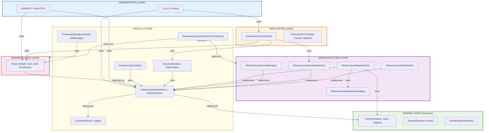

# TaskManager Project Architecture (Delphi 13)

## Architecture Overview

This project is a comprehensive demonstration of **Clean Architecture** principles applied to a Delphi desktop application with REST API support. It showcases best practices including **SOLID principles**, **Domain-Driven Design (DDD)**, and modern software engineering patterns.

### 1. Core Architectural Principles

#### **Clean Architecture**
The project strictly separates concerns into independent layers with clear dependency flows:

- **Direction of Dependencies**: All dependencies point toward the center (Domain Layer)
- **Independence**: Each layer can be tested, modified, and deployed independently
- **Replaceable**: Implementations (Repositories, Services) can be swapped without affecting business logic
- **Framework Agnostic**: Core business logic is independent of Delphi VCL, Indy HTTP, or FireDAC

#### **SOLID Principles**

| Principle | Implementation | Example |
|-----------|-----------------|---------|
| **S** - Single Responsibility | Each class has only one reason to change | `TAuthenticationService` only handles auth; `TPermissionGuard` only handles permissions |
| **O** - Open/Closed | Open for extension, closed for modification | API middleware pipeline: add new middleware without modifying existing code |
| **L** - Liskov Substitution | Derived types are substitutable for base types | All repositories implement `ITaskRepository`; controllers use interface, not concrete class |
| **I** - Interface Segregation | Many specific interfaces better than one general-purpose | `ITaskRepository`, `IUserRepository` instead of single `IRepository` |
| **D** - Dependency Inversion | Depend on abstractions, not concretions | Services depend on `IRepository`, not concrete `TTaskRepository` |

#### **Domain-Driven Design (DDD)**

- **Domain Layer Purity**: Domain models have zero external dependencies
- **Entities & Value Objects**: `TUser`/`TTask` are entities; `TPasswordCredential` is a value object
- **Domain Events**: Capture meaningful business state changes (`TTaskStatusChangedEvent`, `TUserCreatedEvent`)
- **Collect-then-Dispatch Pattern**: Domain events are collected during operations and dispatched after persistence
- **Ubiquitous Language**: Code mirrors business terminology (Status, Role, Specification)
- **Bounded Contexts**: Task management, User management, Security are separate concerns

## 2. Project Layers

| # | Layer | Directory | Purpose |
|---|-------|-----------|---------|
| 1 | **Domain Layer** (innermost) | `src/Domain/` | Entities, Value Objects, Domain Events, Specifications. No dependencies — pure business rules |
| 2 | **Interfaces Layer** (abstractions) | `src/Interfaces/` | Declares all contracts (19 interfaces). All layers depend on this instead of concrete implementations |
| 3 | **Application Layer** | `src/UseCases/` | Orchestrates workflows, DTOs, input validation/sanitization, domain event dispatch |
| 4 | **Business Logic Layer** | `src/Services/` | Enforces business rules, permission checks, authentication, password hashing |
| 5 | **Infrastructure Layer** | `src/Infrastructure/` | Persistence (SQLite/FireDAC), caching (in-memory TTL), event dispatching, data seeding |
| 6 | **Presentation Layer** | `src/UI/` + `src/API/` | UI: VCL Windows forms. API: REST endpoints with Indy HTTP server, middleware pipeline |
| 7 | **Cross-Cutting Concerns** | `src/Common/`, `src/Core/`, `src/Security/`, `src/Threading/`, `src/DependencyInjection/` | Logger, Result monad, SecurityContext, input sanitizer, rate limiter, background jobs, DI container |

---

## 3. Main Call Flow

```
User Click (UI)  /  HTTP Request (API)
        │                    │
        ▼                    ▼
    UseCases            Controllers
   (sanitize,          (parse JSON,
    validate)           auth token)
        │                    │
        └────────┬───────────┘
                 ▼
            Services
     (business rules, permissions)
                 │
                 ▼ (qua interfaces)
          Repositories
     (SQL, FireDAC, SQLite)
                 │
                 ▼
           Database (SQLite)
```

---
## 4. Layer Dependency Diagram

